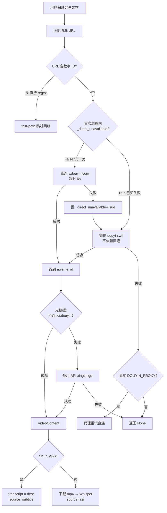

# 抖音视频链接解析 — 技术档案（实操版）

> **文档用途**：供开发者在本机「不能直连抖音、需开 VPN」的环境下，自行判断技术路径、完成配置与实现。
> **典范样例**：下文所有示例均基于已验证的真实链接。
> **代码落点**：`backend/services/video_extractor.py`、`backend/services/asr.py`、`backend/routers/video.py`
> **2026-05-24 更新**：直连优先架构 + ASR 主路径已实装。详见第四节、第七节。

---

## 一、你要解决什么问题

| 输入 | 输出 |
|------|------|
| 用户粘贴抖音分享链接或整段分享文案 | 结构化 `VideoContent`：视频 ID、作者、点赞、**可用于 AI 诊断的文本**（transcript）等 |

下游用途（本项目）：

```
VideoContent → POST /api/diagnosis → DiagnosisResult → 问卷 → 报告
```

**transcript 的质量决定诊断质量**，因此必须明确「文案从哪来」。

---

## 二、典范样例（已跑通，用于对照验收）

### 2.1 用户原始输入

```
https://v.douyin.com/15ZzY6bMaqc/ a@N.wS eoq:/ 01/13 :2pm
```

### 2.2 清洗后的 URL

```
https://v.douyin.com/15ZzY6bMaqc/
```

> **注意**：分享文案里 `a@N.wS eoq:/` 等不是 URL 的一部分，必须用正则只提取短码 `15ZzY6bMaqc`。

### 2.3 解析结果（2026-05-23 实测）

| 字段 | 值 |
|------|-----|
| `video_id` / aweme_id | `7641252398422352293` |
| `author` | 明远AI商业洞察 |
| `likes` | ~24,270（实时会变） |
| `source` | `subtitle`（来自视频描述，非 Whisper） |
| `transcript` 字数 | 123 |

### 2.4 完整 transcript（验收时请与抖音 App「作品描述」对照）

```text
抓住AI时代红利 很多人还没意识到。
AI真正改变的，
不是某个行业。
而是普通人的生产力。
如果你现在还没开始接触 Codex、Cloud Code。
那你可能正在错过这一轮最大的时代红利。
#AI #Codex  #ChatGPT #AI时代
```

### 2.5 自测命令

```bash
cd backend
source .venv/bin/activate

# 在 .env 中设置 SKIP_ASR=true 后：
SKIP_ASR=true python scripts/test_real_extract.py
```

---

## 三、你的网络环境：如何做判断

### 3.1 三种典型环境

```
┌─────────────────────────────────────────────────────────────┐
│ 环境 A：国内网络（不开 VPN）→ 直连 iesdouyin.com 通畅        │
│   → 优先直连 iteminfo API，最快、最稳                         │
├─────────────────────────────────────────────────────────────┤
│ 环境 B：开梯子但本地系统代理干扰抖音 TLS                       │
│   → trust_env=False + 不设系统代理；或 DOUYIN_PROXY 指本地端口 │
├─────────────────────────────────────────────────────────────┤
│ 环境 C：开 VPN（走国外出口）→ 无法访问 *.douyin.com           │
│   → 走「镜像 API + 备用聚合 API」，不依赖直连抖音              │
└─────────────────────────────────────────────────────────────┘
```

**作者本机情况**：人在国内，但 Anthropic Claude 等模型需要走 VPN（梯子）才能用，开发期间 VPN 长开 → 实际跑出来是「环境 C」。**部署到国内服务器或暂时关掉 VPN 时**就变成「环境 A」，直连直接成功，无需任何配置。

### 3.2 30 秒自检流程

**Step 1 — 测直连抖音（可选）**

```bash
curl -s http://localhost:8000/api/video/ping | python3 -m json.tool
```

看返回里 `targets` 各域名是否 `"ok": true`。

| 结果 | 判断 |
|------|------|
| `iesdouyin.com` / `v.douyin.com` 均 `ok: false` | **环境 C**，不要浪费时间配直连，走备用 API |
| 仅 `v.douyin.com` 失败 | 短链问题，仍可用镜像 + 备用 API |
| 均 `ok: true` | **环境 A**，可优先直连，备用 API 作兜底 |

**Step 2 — 测镜像 aweme_id（不访问抖音 CDN）**

```bash
curl -s "https://api.douyin.wtf/api/douyin/web/get_aweme_id?url=https://v.douyin.com/15ZzY6bMaqc/" | python3 -m json.tool
```

期望：`"code": 200`, `"data": "7641252398422352293"`

**Step 3 — 测备用聚合 API**

```bash
curl -s "https://api.xingzhige.com/API/douyin/?url=https://v.douyin.com/15ZzY6bMaqc/" | python3 -m json.tool
```

期望：`"code": 0`, `data.item.title` 含完整文案。

### 3.3 关于 VPN 的关键结论

| 误区 | 事实 |
|------|------|
| 「开了 VPN，Python 会自动走 VPN」 | httpx 默认 `trust_env=False`，**故意不走**系统代理，避免 Clash 导致抖音 TLS 失败 |
| 「必须配 DOUYIN_PROXY 才能上网」 | 只有访问 **抖音域名** 时才需要；备用 API 访问的是 `api.xingzhige.com`，与抖音无关 |
| 「VPN 开全局就能解析」 | 全局 VPN 下直连抖音仍可能失败；**推荐演示配置：不设 DOUYIN_PROXY，用备用 API** |

**你的推荐路径（开发期间 VPN 长开，相当于环境 C）：**

```
分享文案 → 清洗 URL → 镜像拿 aweme_id → 备用 API 拿元数据+文案 → VideoContent
（SKIP_ASR=true，不走下载和 Whisper）
```

---

## 四、技术路径规划（决策树）

> **2026-05-24 重要更新**：代码已经重排为**直连优先 + API 兜底**架构。下面的决策树反映**当前实现**。



### 4.1 路径对比表

| 路径 | 依赖 | 单次耗时（实测） | 文案来源 | 适用场景 |
|------|------|------|----------|----------|
| **P0 fast-path 长链含 ID** | 无 | <100ms | 视频描述 | 已带 aweme_id 的输入 |
| **P1 直连 + SKIP_ASR**（国内/能直连）| 能访问抖音 | **3～5 秒** | 描述字段 | 国内服务器、无 VPN 干扰 |
| **P2 兜底链 + SKIP_ASR**（开发期间 VPN 长开）| 备用 API | 首次 ~13s / 后续 ~9s | 视频描述/标题 | **黑客松 Demo、env C** |
| P3 直连 + ASR | 抖音 + OpenAI | **1～2 分钟** | Whisper 口播 | 追求口播一致 |
| P4 手动输入 | 无 | 即时 | 用户粘贴 | 解析失败降级 |

**短路机制**：进程内首次直连失败后置 `_direct_unavailable=True`，后续请求跳过直连阶段，省去 5～6 秒。重启服务（或人工调用 ping）重置。

---

## 五、架构与数据流

### 5.1 模块关系

```
frontend/lib/api.ts          extractVideo(url)
        │ POST /api/video/extract
        ▼
backend/routers/video.py     extract_video()
        ▼
backend/services/video_extractor.py
        ├── _extract_url_from_share_text()
        ├── _resolve_aweme_id()          ← 镜像 + 可选直连
        ├── _fetch_aweme_metadata()      ← 直连 → 备用 API → 代理重试
        ├── _transcribe_video()          ← 可选 Whisper
        └── _build_video_content()       → VideoContent
```

### 5.2 VideoContent 合约（与 schemas.py 一致）

```python
class VideoContent(BaseModel):
    video_id: str           # aweme_id
    transcript: str         # AI 诊断用的主文本（必填）
    title: str              # 通常与 desc 相同
    author: str
    likes: Optional[int]
    comments: Optional[int]
    shares: Optional[int]
    play_count: Optional[int]
    duration_seconds: Optional[int]
    is_ad: Optional[bool]
    with_shop_entry: Optional[bool]
    commerce_level: Optional[int]
    creator_verified: Optional[str]
    follower_count: Optional[int]
    hashtags: Optional[list[str]]
    source: Literal["asr", "subtitle", "manual"]
```

| source 值 | 含义 |
|-----------|------|
| `subtitle` | 描述/标题文案（当前典范样例即是） |
| `asr` | Whisper 转录口播 |
| `manual` | 用户手动粘贴 |

---

## 六、环境配置（.env 实操清单）

在 `backend/.env` 中按需添加（**不要提交到 Git**）：

### 6.1 推荐配置（开 VPN 时演示用，主走 API 兜底）

```env
# ── 抖音解析 ──
# 暂时跳过 ASR（抖音 CDN 在 VPN 环境下不通，下不了视频）
SKIP_ASR=true

# ── ASR / Whisper（仍要配，回国内或部署后立刻生效）──
OPENAI_API_KEY=sk-...
OPENAI_BASE_URL=https://api.openai-next.com   # 与 Anthropic 共用同一个中转

# ── 备用解析 API（默认值，可省略）──
DOUYIN_FALLBACK_API=https://api.xingzhige.com/API/douyin/
DOUYIN_MIRROR_API=https://api.douyin.wtf/api/douyin/web/get_aweme_id
```

### 6.2 关 VPN（国内网络）/ 部署国内服务器 — 全功能启用

```env
# 抖音 CDN 通畅 + 中转 Whisper 通畅，ASR 主路径完整工作
# 不设 SKIP_ASR（让 ASR 默认开启）
OPENAI_API_KEY=sk-...
OPENAI_BASE_URL=https://api.openai-next.com
# 不设 DOUYIN_PROXY（直连抖音通畅）
```

### 6.3 配置项说明表

| 变量 | 默认值 | 作用 |
|------|--------|------|
| `OPENAI_API_KEY` | 无（必填启用 ASR）| Whisper 凭证（多数中转和 Anthropic 共用一把 key）|
| `OPENAI_BASE_URL` | 无（用 OpenAI 官方）| 中转 base URL，代码自动补 `/v1` 路径 |
| `SKIP_ASR` | 未设置（false） | `true` 时跳过下载+Whisper，用描述文案降级 |
| `DOUYIN_PROXY` | 无 | 仅访问抖音域名时使用；格式 `http://127.0.0.1:端口` |
| `DOUYIN_FALLBACK_API` | `https://api.xingzhige.com/API/douyin/` | 直连失败后的聚合解析 |
| `DOUYIN_MIRROR_API` | `https://api.douyin.wtf/.../get_aweme_id` | 从短链解析 aweme_id |

---

## 七、实现细节（按执行顺序）

### 7.1 Step 1：清洗 URL

**问题**：用户粘贴整段分享文案，`\S+` 会把 `a@N.wS` 吃进 URL，导致请求失败。

**规则**：

```python
SHORT_LINK_RE = re.compile(r"https?://v\.douyin\.com/([A-Za-z0-9_-]+)/?")
# 命中 → https://v.douyin.com/{短码}/
```

支持形态：

| 输入类型 | 示例 |
|----------|------|
| 短链+文案 | `https://v.douyin.com/15ZzY6bMaqc/ a@N.wS ...` |
| 纯短链 | `https://v.douyin.com/15ZzY6bMaqc/` |
| 长链 | `https://www.douyin.com/video/7641252398422352293` |

### 7.2 Step 2：解析 aweme_id

**新版顺序（2026-05-24 已实现，直连优先）**：

1. **fast-path**：如 URL 已含数字 ID（如 `/video/7641...`），regex 直接返回，无网络
2. **直连**（PRIMARY，进程内 `_direct_unavailable=False` 时）
   ```
   GET https://v.douyin.com/{短码}/  follow_redirects=True  timeout=6s
   → 从最终 URL / HTML / _ROUTER_DATA 提取数字 ID
   ```
   失败 → 置 `_direct_unavailable=True`，后续请求跳过此步
3. **镜像 API**（FALLBACK，不依赖直连抖音）
   ```
   GET https://api.douyin.wtf/api/douyin/web/get_aweme_id?url={清洗后URL}
   → {"code":200,"data":"7641252398422352293"}
   ```
4. **显式代理重试**（仅当配置 `DOUYIN_PROXY` 时）

**典范样例耗时**：
- 环境 A（不开 VPN，国内网络）：~3 秒（步骤 2 完成）
- 环境 C（开 VPN，走国外出口）：首次 ~7 秒（6s 直连超时 + 1s 镜像），后续 ~1 秒（短路后直接走镜像）

### 7.3 Step 3：获取元数据

**新版顺序（2026-05-24 已实现）**：

1. **直连 iesdouyin**（PRIMARY，受 `_direct_unavailable` 短路控制）
   - `GET iesdouyin.com/web/api/v2/aweme/iteminfo/?item_ids={id}`
   - `GET iesdouyin.com/share/video/{id}` → 解析 `_ROUTER_DATA`
2. **备用聚合 API**（FALLBACK）
   ```
   GET https://api.xingzhige.com/API/douyin/?url={清洗后URL}
   ```
3. **显式代理重试**（仅当配置 `DOUYIN_PROXY`）

**备用 API 响应 → 内部 meta 映射**（核心字段）：

| 备用 API 字段 | 映射到 meta |
|---------------|-------------|
| `data.stat.aweme_id` | `aweme_id` |
| `data.item.title` | `desc`（即 transcript 来源） |
| `data.author.name` | `author.nickname` |
| `data.stat.like` | `statistics.digg_count` |
| `data.item.url` | `video.play_addr.url_list[0]`（供 ASR 下载） |

**典范样例耗时**：
- 环境 A（不开 VPN）：~2 秒（直连 iteminfo 命中）
- 环境 C（开 VPN）：首次 ~6 秒（直连两步超时 + 备用 API ~6s），后续 ~6 秒（短路后直接走备用）

### 7.4 Step 4：生成 transcript

| 条件 | 行为 |
|------|------|
| **默认（未设 SKIP_ASR）** | 下载 mp4 → `services/asr.py` Whisper → `source=asr` ★ **主路径** |
| `SKIP_ASR=true` | `transcript = meta.desc`，`source=subtitle`（演示降级用）|
| ASR 失败（视频下载失败 / Whisper 失败） | 自动降级到 `desc`，`source=subtitle` |

**Whisper 调用配置**：
- 走 `OPENAI_BASE_URL` 中转（与 Anthropic 共用同一个网关 key）
- `model=whisper-1`、`language=zh`
- 实测：30s 视频 → 65KB 音频/2MB 视频上传 → ~3 秒返回中文转录
- 中转兼容性已验证：`api.openai-next.com` 支持 `/v1/audio/transcriptions`

**典范样例（开启 ASR）**：39 秒视频 → 下载 ~5s + Whisper ~3s = **总 ~8 秒**，得到口播逐字稿（约 80-150 字），明显优于描述文案（30-50 字）。

### 7.5 Step 5：组装 VideoContent

```python
return VideoContent(
    video_id=aweme_id,
    transcript=transcript,
    title=meta["desc"][:200],
    author=meta["author"]["nickname"],
    likes=statistics["digg_count"],
    source="subtitle",  # 或 asr / manual
    ...
)
```

### 7.6 Step 6：对外 API

| 方法 | 路径 | 说明 |
|------|------|------|
| POST | `/api/video/extract` | body: `{"url":"分享文本"}`，成功 200 返回 VideoContent |
| POST | `/api/video/manual` | 解析失败时前端降级 |
| GET | `/api/video/ping` | 网络自检 |

失败响应：

```json
{
  "error": "视频解析失败，请手动粘贴视频内容",
  "code": "EXTRACT_FAILED",
  "fallback_available": true
}
```

---

## 八、耗时预估（单条链接）

> **2026-05-24 重测数据**（重排后，直连优先 + 短路）

### 你的开发环境（开 VPN，直连抖音失败，跳 ASR）

| 请求次序 | 阶段 | 耗时 | 累计 |
|---|---|---|---|
| 第 1 次 | 清洗 URL | <1ms | 0s |
| | 直连 v.douyin.com（超时） | ~6s | ~6s |
| | 镜像 API aweme_id | ~1s | ~7s |
| | 直连 iesdouyin（超时） | ~1s | ~8s |
| | 备用 API xingzhige | ~5s | **~13s** |
| 第 2 次 | 短路（跳过两次直连）| | **~9s** |

**实测**：用户的 `SUYJB1r8zjo` 链接，第一次 13.4s，第二次 8.9s。

### 关 VPN / 国内服务器（含 ASR）

| 阶段 | 耗时 | 累计 |
|------|------|------|
| 清洗 URL | <1ms | 0s |
| 直连 v.douyin.com 取 ID | ~2s | ~2s |
| 直连 iesdouyin 元数据 | ~2s | ~4s |
| **下载 mp4**（39s 短视频 ~2MB） | ~5s | ~9s |
| **Whisper 转录** | ~3s | **~12s** |
| 组装 VideoContent | <1ms | ~12s |

**实测**（ASR 部分用本地 65KB 中文 TTS 验证）：Whisper 链路 3.5 秒，结果完全准确。

### 若开启 ASR（典范视频约 15MB / 100s）

| 额外阶段 | 预估 |
|----------|------|
| 下载 mp4 | 20～40s |
| Whisper API | 15～30s |
| **总计** | **约 1～2 分钟** |

---

## 九、httpx 网络要点（必读）

```python
httpx.AsyncClient(
    trust_env=False,   # 不读 HTTP_PROXY/HTTPS_PROXY，避免 Clash 搞挂抖音
    proxy=os.environ.get("DOUYIN_PROXY"),  # 仅显式指定时才走代理
    timeout=30,
)
```

| 现象 | 原因 | 处理 |
|------|------|------|
| `ConnectError` + 堆栈含 `http_proxy` | 系统代理 TLS 问题 | 保持 `trust_env=False` |
| 直连失败但浏览器能开抖音 | Python 未走 VPN | 设 `DOUYIN_PROXY=http://127.0.0.1:7890` |
| 直连失败且不想配代理 | 正常 | 用备用 API，无需访问抖音 |
| `encrypt_data_miss` | 官方 API 要 cookie 签名 | 改用备用 API |

---

## 十、第三方 API 参考

### 10.1 镜像：douyin.wtf（仅 aweme_id）

```
GET https://api.douyin.wtf/api/douyin/web/get_aweme_id?url={url}

成功：
{"code":200,"router":"...","data":"7641252398422352293"}

失败：
code != 200 或超时 → 依赖直连短链
```

> 注意：同站的 `fetch_one_video`、`hybrid/video_data` 在 2026-05 实测**不可用**（返回 400），不要依赖。

### 10.2 备用：xingzhige（完整元数据，典范样例使用）

```
GET https://api.xingzhige.com/API/douyin/?url={url}

成功：code=0，见第二节典范 JSON 结构
失败：code=-1 → 换链接或换备用源
```

**风险**：第三方聚合 API 无 SLA，黑客松应保留 `manual` 降级和 Demo 预缓存 JSON。

### 10.3 官方：iesdouyin iteminfo（环境 A：不开 VPN）

```
GET https://www.iesdouyin.com/web/api/v2/aweme/iteminfo/?item_ids={aweme_id}
Header: User-Agent 移动端, Referer: https://www.douyin.com/

成功：item_list[0] 即为 meta
失败：status_code 11110 encrypt_data_miss → 走备用 API
```

---

## 十一、实操 Checklist（按顺序打勾）

### 阶段 0：准备

- [ ] `cd backend && python3 -m venv .venv && source .venv/bin/activate`
- [ ] `pip install -r requirements.txt`
- [ ] 复制 `.env.example` → `.env`，填入 AI Key（若要走诊断）

### 阶段 1：网络判断

- [ ] `uvicorn main:app --reload --port 8000`
- [ ] `curl http://localhost:8000/api/video/ping`
- [ ] 记录：直连抖音是否 OK → 决定用 P1 还是 P2 路径（见第四节）

### 阶段 2：配置 .env（你的环境）

- [ ] `SKIP_ASR=true`
- [ ] **不设置** `DOUYIN_PROXY`（除非你要试官方直连）
- [ ] 确认 VPN 能访问 `api.xingzhige.com`（浏览器打开或 curl）

### 阶段 3：单条解析验收

- [ ] `SKIP_ASR=true python scripts/test_real_extract.py`
- [ ] 对照第二节：aweme_id、作者、**完整 123 字文案**一致
- [ ] `source` 为 `subtitle`

### 阶段 4：接入 API

- [ ] `curl -X POST http://localhost:8000/api/video/extract -H "Content-Type: application/json" -d '{"url":"https://v.douyin.com/15ZzY6bMaqc/ a@N.wS eoq:/ 01/13 :2pm"}'`
- [ ] 200 + JSON 含 `transcript`

### 阶段 5：接入诊断全链路

- [ ] `POST /api/diagnosis` 传入返回的 VideoContent 字段
- [ ] 前端或 curl 验证诊断结果合理

### 阶段 6（可选）：ASR

- [ ] `.env` 配置 `OPENAI_API_KEY`，去掉 `SKIP_ASR`
- [ ] 配置 `DOUYIN_PROXY`（下载 douyinvod 常用）
- [ ] 对比 `transcript` 与 App 内口播是否更一致

---

## 十二、失败处理与降级

```
extract 失败 (422 EXTRACT_FAILED)
    → 前端展示手动输入框
    → POST /api/video/manual { title, text, author? }

演示保底
    → frontend/public/demo/demo_1.json 等预缓存
    → 不调用 extract，保证评委流程不断
```

---

## 十三、相关文件索引

| 文件 | 用途 |
|------|------|
| `backend/services/video_extractor.py` | 核心解析逻辑 |
| `backend/services/asr.py` | Whisper 转录 |
| `backend/routers/video.py` | HTTP 路由 |
| `backend/models/schemas.py` | VideoContent 模型 |
| `backend/scripts/test_real_extract.py` | 端到端实测脚本 |
| `backend/scripts/test_cdn_extract.py` | 分步：URL → aweme_id → 元数据 |
| `backend/.env.example` | 配置模板 |
| `frontend/lib/api.ts` | `extractVideo()` 前端调用 |

---

## 十四、总结：你的环境一句话方案

> **开 VPN 走国外出口时**：`.env` 设 `SKIP_ASR=true`，不设 `DOUYIN_PROXY`，依赖 `api.douyin.wtf` 拿 ID + `api.xingzhige.com` 拿文案；单条首次约 **13 秒**、后续约 **9 秒**；用第二节 123 字文案验收；口播级精度再开 ASR + 代理下载。
>
> **关掉 VPN 回到国内网络**：什么配置都不用动，代码会自动直连成功，单条约 **4 秒**。

---

*文档版本：2026-05-23 | 典范链接：v.douyin.com/15ZzY6bMaqc | aweme_id：7641252398422352293*
